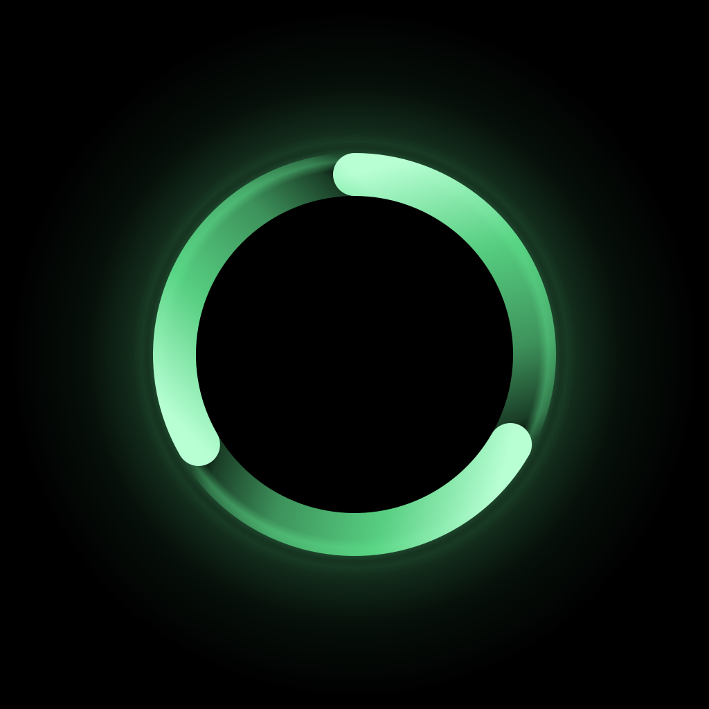

<div align="center">



# Halo Ring · 环意

**Where the ring goes, the world moves.** · 「环之所至，意之所达」

*by Zack 紫意*

[English](#english) · [中文](#中文)

</div>

---

## English

Wear a **QRing R08 smart ring** as a single, wireless remote for **AR glasses** — **Rokid Glasses**
(primary, on-device validated) and **RayNeo X3 Pro**. Same operations, same UI, automatic
hand-over when you switch glasses. One codebase, two product flavors.

Tap to confirm, swipe to navigate, long-press to wake/sleep the screen — all from a ring on your
finger. A shell-uid input agent injects events directly via `InputManager.injectInputEvent`
(roughly 1–3 ms of added latency, versus ~100 ms+ to spawn `adb shell input keyevent` per
gesture), so the ring drives the glasses **system-wide**, not just inside this app.

### Get an APK

Pre-built release APKs for both glasses live on the [**Releases**](../../releases) page:

| Glasses | Use the file named |
|---|---|
| Rokid Glasses | `halo-ring-rokid.apk` |
| RayNeo X3 Pro | `halo-ring-rayneo.apk` |

`adb install -r halo-ring-<glasses>.apk` after enabling sideloading, then open the app once and
follow the first-run wizard (it pairs the ring + bootstraps the input agent — no computer needed
after that, and it survives a reboot).

> **No glasses yet?** The full reverse-engineered BLE protocol is published at
> [`Doc/09-r08-ble-protocol-spec.md`](Doc/09-r08-ble-protocol-spec.md) — confirm the ring works
> with any Python BLE library and the byte tables in that doc.

### Features

- **3-tab home** — **RING** (status + reconnect + find ring), **VITALS** (HR / SpO₂ + measure),
  **MORE** (gestures & profiles, system settings). Switch tabs with an in-app **long-press**;
  out of the app, long-press wakes/sleeps the glasses.
- **Configurable gesture vocabulary** — tap, double-tap, triple-tap, long-press, swipe up/down
  (dual-axis, so it drives both vertical lists and the horizontal app grid), and tap-then-swipe
  combos. Each combo group has its own confirmation window and on/off switch; bind any gesture per
  profile in the editor.
- **Four auto-switching profiles** — Navigation, Media, Reader, Camera (plus a manual Fast
  profile). The active profile is inferred from the foreground app; no manual switching needed.
- **No-computer, reboot-surviving agent** — the input agent runs as a shell-uid `app_process`
  over a Wi-Fi-independent loopback ADB port, bootstrapped once via on-device wireless pairing.
  It revives itself after a reboot with zero user action, and keeps working with Wi-Fi off.
- **HUD overlay** — a transient off-axis overlay shows charging milestones, every-500-steps,
  wear / drop / (dis)connect, and recognised gestures. If the screen is asleep when a notice
  arrives it briefly lights up, then auto-sleeps. Position + vertical offset are configurable.
- **On-demand vitals** — HR + SpO₂ measured together on one tap (the PPG runs only during the
  measurement, never continuously); passive step / distance counters come "free"; an auto-snapshot
  fires the moment you put the ring on, so the readout is usually fresh before you press measure.
- **Bluetooth-internet auto-enable** — with Wi-Fi off, the glasses get internet over the phone's
  Bluetooth tethering; Halo Ring re-enables the per-device toggle on every boot.
- **Cross-glasses hand-over + bilingual UI** — the ring follows whichever glasses you're wearing;
  Settings → Language switches English / 中文 (default follows system).

### Architecture

A pure-Kotlin/JVM `:core` module owns the gesture state machine, the routing pipeline, and the
power policy — fully unit-testable on the JVM (**277 tests** at HEAD). `:app` is the Android
shell: a foreground service runs the BLE central, a Compose UI exposes settings, and two product
flavors (`rokid` / `rayneo`) supply per-glasses transports. `:agent` is a tiny dex that runs as a
shell-uid `app_process`, talks to `:app` over a `LocalSocket`, and calls
`InputManager.injectInputEvent` directly via reflection — the same trick scrcpy and Shizuku use.
Full rationale is in **[Doc/](Doc/)** — start at [Doc/01-overview.md](Doc/01-overview.md), or
[Doc/04-interaction-design.md](Doc/04-interaction-design.md) for the gesture / profile model and
[Doc/03-architecture.md](Doc/03-architecture.md) for the latency / power budget. The complete BLE
protocol is [Doc/09-r08-ble-protocol-spec.md](Doc/09-r08-ble-protocol-spec.md).

Design mockups: open [`Doc/ui-mockup.html`](Doc/ui-mockup.html) in a browser.

### Build it yourself

```bash
cd app-project
./gradlew :core:test                # 277 tests, no Android SDK needed
./gradlew :app:assembleRokidDebug   # ~15 MB debug  (release after R8 ≈ 4 MB)
./gradlew :app:assembleRayneoDebug
```

Both flavors build clean from a fresh checkout. The RayNeo flavor pulls in the
openly-distributable Mercury Android SDK AAR (committed at
[`app-project/app/libs/mercury-release.aar`](app-project/app/libs/mercury-release.aar)).

### Contributing

This started as a personal hardware-tinkering project (the full design trail lives in
[Doc/](Doc/)) and is open-sourced under **GNU AGPLv3** for anyone who wants a smart-ring ↔ AR-glasses
bridge. **Forks must stay open-source under AGPLv3, end to end** — see Legal below. Especially
welcome: R08 protocol verification on your own ring (PRs to
[`Doc/09-r08-ble-protocol-spec.md`](Doc/09-r08-ble-protocol-spec.md)), additional
`ExecutorBackend` implementations, and per-platform feature-Intent maps. Open an issue first for
anything substantive — the design docs in [Doc/](Doc/) are the source of truth. See
[`CONTRIBUTING.md`](CONTRIBUTING.md).

### Legal

**Dual-licensed. The open-source license is strongly copyleft — it is viral and chains down every
fork, service, and derivative.**

- **GNU AGPLv3** (see [`LICENSE`](LICENSE)) for personal, community, research, and open-source
  use. **Every derivative is bound by the same terms, recursively**: if you modify Halo Ring, fork
  it, embed it, or run a modified version as a network service, you **must publish your complete
  corresponding source under AGPLv3** — and so must anyone downstream of you. There is no private
  fork and no closed embedding under this license. This applies to the code **and** to the
  published protocol specification ([Doc/09](Doc/09-r08-ble-protocol-spec.md)) and design docs as
  creative works — see [`COPYRIGHT.md`](COPYRIGHT.md).
- **Commercial license** for any use that can't comply with AGPL's copyleft (closed-source
  embedding, proprietary SaaS, OEM bundling) — see [`COMMERCIAL-LICENSE.md`](COMMERCIAL-LICENSE.md).
  Email `zackzhang0813@gmail.com` to start a conversation.

© 2026 Zack Zhang (紫意). The QRing R08 BLE protocol was reverse-engineered **entirely
first-hand** — captured, replayed, and verified end-to-end on real hardware (firmware
`RT08_3.10.46`) — with no other project used as a reference. Raw interoperability facts (byte
values, command sequences) are not copyrightable; the spec's expression, organization, and the
app's source code are. No third-party application source is incorporated. Not affiliated with
QRing, Rokid, RayNeo, Mercury, or any vendor.

"Halo Ring" + "环意" + the launcher icon are unregistered trademarks of the author; forks should
use "based on Halo Ring" framing rather than claiming the name. See [`COPYRIGHT.md`](COPYRIGHT.md)
for the full policy.

---

## 中文

戴一枚 **QRing R08 智能戒指**，把它当作 **AR 眼镜** 的统一无线遥控——**Rokid Glasses**（主力、已真机
验证）与 **RayNeo X3 Pro**。一套交互、一套 UI，换眼镜自动切换。一份代码，两个产品 flavor。

单击确认、滑动翻页、长按唤屏/息屏，全部从手指上的戒指完成。注入 agent 以 shell uid 直接调用
`InputManager.injectInputEvent`（额外延迟约 1–3 ms，而每次手势 spawn 一次 `adb shell input
keyevent` 要 ~100 ms+）。戒指**系统级**驱动眼镜，不止在本 app 内。

### 拿 APK

两副眼镜的预编译 release APK 都挂在 [**Releases**](../../releases) 页：

| 眼镜 | 用这个文件 |
|---|---|
| Rokid Glasses | `halo-ring-rokid.apk` |
| RayNeo X3 Pro | `halo-ring-rayneo.apk` |

开启侧载后 `adb install -r halo-ring-<眼镜>.apk`，打开 app 跟随首次向导（配对戒指 +
引导注入 agent）——之后**无需电脑，且能扛重启**。

> **暂时没有眼镜？** 逆向出来的完整 BLE 协议已开源在
> [`Doc/09-r08-ble-protocol-spec.md`](Doc/09-r08-ble-protocol-spec.md)——拿任何 Python BLE 库
> + 文中字节表就能在笔记本上验证戒指。

### 功能

- **三横向 Tab 首页**——**RING**（状态 + 重连 + 找戒指）、**VITALS**（心率/血氧 + 测量）、
  **MORE**（手势与配置、系统设置）。应用内**长按**切 tab；应用外长按是唤屏/息屏。
- **可配置的手势词汇**——单击、双击、三击、长按、上/下滑（双轴，纵向列表与横向 app 网格都能走）、
  以及"单击接滑动"组合。每个组合分组都有各自的确认窗口与开关；编辑器里可按 profile 任意绑定。
- **四个自动切换的 profile**——导航 / 媒体 / 阅读 / 相机（另有一个手动的 Fast），按前台 app 自动判定，
  无需手动切。
- **无需电脑、扛重启的 agent**——注入 agent 以 shell uid 通过**与 Wi-Fi 无关的 loopback ADB 端口**
  运行，首次靠机内无线配对引导；重启后零操作自愈，Wi-Fi 关着也能用。
- **HUD 浮层**——瞬时、放视线外侧，提示充电里程碑、每 500 步、佩戴 / 跌落 / 断连重连、识别到的手势。
  灭屏时来通知会短暂点亮屏幕再自动息屏。位置与上下偏移可配。
- **按需生理测量**——一次点按并行测心率 + 血氧（PPG 只在测量时亮，绝不常亮）；被动步数/距离"免费"
  获得；戴上戒指瞬间自动测一次，所以点测量前一般已有新鲜数据。
- **蓝牙网络自动开启**——Wi-Fi 关闭时，眼镜通过手机蓝牙共享上网；Halo Ring 每次开机帮你重新打开开关。
- **跨眼镜切换 + 双语**——戒指跟随当前佩戴的眼镜；Settings → Language 切换中英文（默认跟随系统）。

### 架构

`:core` 是纯 Kotlin/JVM 模块，承载手势状态机、路由管线和功耗策略，全部 JVM 可单测（HEAD 处
**277 个测试**）。`:app` 是 Android 壳：常驻前台服务跑 BLE central，Compose UI 提供设置，两个
flavor（`rokid` / `rayneo`）提供各自传输层。`:agent` 是微型 dex，以 shell uid 通过 `app_process`
运行，走 `LocalSocket` 直接反射调 `InputManager.injectInputEvent`——和 scrcpy / Shizuku 同源。
完整设计在 **[Doc/](Doc/)**——从 [Doc/01-overview.md](Doc/01-overview.md) 开始，手势/profile
模型看 [Doc/04-interaction-design.md](Doc/04-interaction-design.md)，延迟/功耗看
[Doc/03-architecture.md](Doc/03-architecture.md)。完整 BLE 协议是
[Doc/09-r08-ble-protocol-spec.md](Doc/09-r08-ble-protocol-spec.md)。界面设计稿见
[`Doc/ui-mockup.html`](Doc/ui-mockup.html)。

### 自己编译

```bash
cd app-project
./gradlew :core:test                # 277 测试，无需 Android SDK
./gradlew :app:assembleRokidDebug   # ~15 MB debug（R8 后 release ≈ 4 MB）
./gradlew :app:assembleRayneoDebug
```

两个 flavor 从干净 checkout 都能直接编通。RayNeo flavor 依赖公开可分发的 Mercury ARDK AAR，
已提交在 [`app-project/app/libs/mercury-release.aar`](app-project/app/libs/mercury-release.aar)。

### 贡献

从个人硬件折腾起步（设计全过程见 [Doc/](Doc/)），以 **GNU AGPLv3** 开源。**Fork 必须端到端保持
AGPLv3 开源**——见下方"法律"。特别欢迎：用你的 R08 验证协议（对
[`Doc/09-r08-ble-protocol-spec.md`](Doc/09-r08-ble-protocol-spec.md) 开 PR）、更多
`ExecutorBackend`、实机发现的 per-platform feature Intent。实质性改动先开 issue。详见
[`CONTRIBUTING.md`](CONTRIBUTING.md)。

### 法律

**双重许可。开源许可是强 copyleft——病毒式、链式向下传染每一个 fork、服务与衍生品。**

- **GNU AGPLv3**（见 [`LICENSE`](LICENSE)）用于个人、社区、研究、开源场景。**每一个衍生品都被同样
  条款递归绑定**：你修改、fork、嵌入，或以网络服务形式运行修改版，就**必须把你完整的对应源码以
  AGPLv3 公开**——你的下游也必须如此。本许可下不存在私有 fork、不存在闭源嵌入。此约束同时覆盖**代码**
  与已开源的**协议规范**（[Doc/09](Doc/09-r08-ble-protocol-spec.md)）及设计文档（作为创作作品）——
  见 [`COPYRIGHT.md`](COPYRIGHT.md)。
- **商业许可** 用于无法满足 AGPL copyleft 的场景（闭源嵌入、专有 SaaS、OEM 预装）——见
  [`COMMERCIAL-LICENSE.md`](COMMERCIAL-LICENSE.md)，邮件 `zackzhang0813@gmail.com`。

© 2026 Zack Zhang (紫意)。QRing R08 的 BLE 协议为本人**完全自主、第一手逆向**——在真机上抓包、
回放并端到端验证（固件 `RT08_3.10.46`），未参考任何其他项目。协议事实（字节值、命令序列）
不受著作权保护；规范的表达组织与 app 源码受保护。未含任何第三方应用源码。与 QRing、Rokid、
RayNeo、Mercury 等厂商无关联。

"Halo Ring" / "环意" / 启动器图标 是作者未注册商标——fork 请用"基于 Halo Ring"措辞。完整条款见
[`COPYRIGHT.md`](COPYRIGHT.md)。
