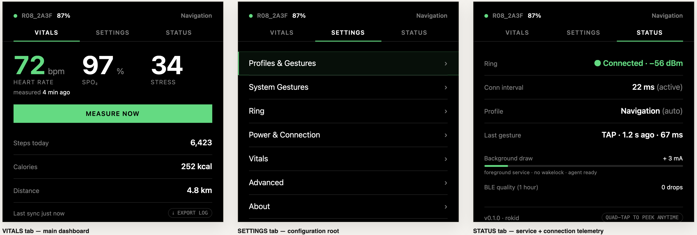
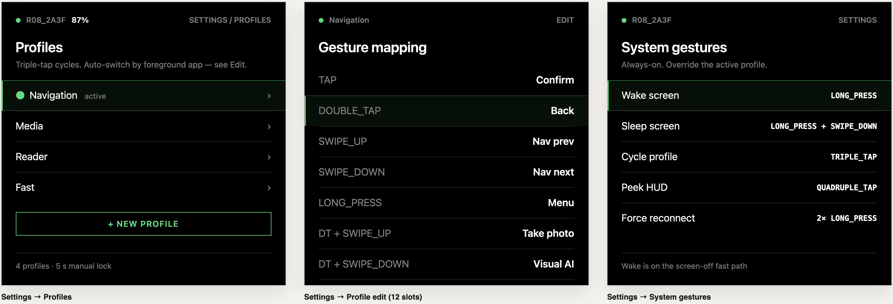
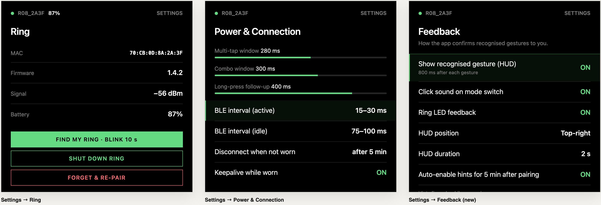
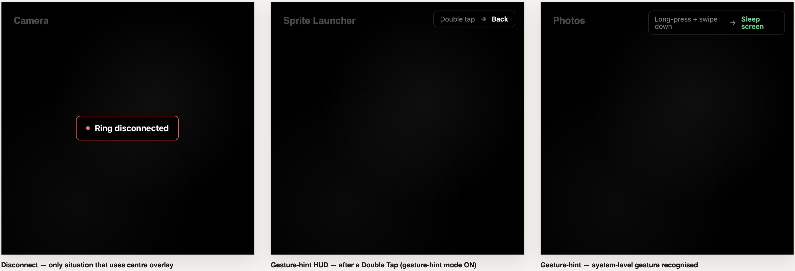

<div align="center">


# Halo Ring · 环意

**Where the ring goes, the world moves.** · 「环之所至，意之所达」

*by Zack 紫意*

[English](#english) · [中文](#中文)

</div>

---

## English

Wear a **QRing R08 smart ring** as a single, wireless remote for **two pairs of AR glasses** —
**Rokid Glasses** and **RayNeo X3 Pro**. Same operations, same UI, automatic hand-over when you
switch glasses. One codebase, two flavors.

Tap-to-confirm, swipe-to-navigate, long-press-to-wake-screen — all from a ring on your finger,
end-to-end median ~5 ms from ring touch to on-glasses reaction (about 30× faster than the
reference Chinese-community app, validated on a OnePlus 9 Pro / Android 14 development rig).

### Get an APK

The freshest debug + release APKs for both glasses live on the
[**Releases**](../../releases) page:

| Glasses | Use the file named |
|---|---|
| Rokid Glasses | `halo-ring-rokid-release.apk` (or `-debug.apk` for verbose logs) |
| RayNeo X3 Pro | `halo-ring-rayneo-release.apk` (or `-debug.apk`) |

The **"Latest build (main)"** release is auto-updated on every push to `main`. Tagged releases
(`v0.1.0` etc.) are pinned versions when those exist.

Install with `adb install -r halo-ring-<glasses>-release.apk` after sideloading is enabled. The
ring pairs through the in-app first-run wizard — open the app once, follow the five steps, then
the ring is your remote forever.

> **No glasses yet?** You can still play with the ring. The Python probe in
> [`phase0/`](phase0/) (`python3 r08_probe.py --tutorial`) walks you through all 12 gestures on
> any laptop with Bluetooth, so you can confirm the ring works before sideloading anything.

### What it looks like

The three main tabs and the settings tree — these are the mockup renders; real on-glasses
screenshots will replace them once hardware arrives. Live version at
[`Doc/ui-mockup.html`](Doc/ui-mockup.html).



Per-profile gesture mapping and the always-on system gestures:



Ring telemetry, BLE-interval / timing tuning, and feedback prefs:



The transient HUD overlay on the glasses (disconnect + per-gesture hints):



### What's in the box

- **12-gesture vocabulary** — tap / double / triple / quadruple-tap, long-press, two swipes,
  plus all the long-press-and-swipe combos. Bind any of them to anything via the in-app
  Profiles editor.
- **Four built-in profiles** — Navigation, Media, Reader, Fast. Each profile fills all 12
  slots with sensible defaults; switch by triple-tap, or auto-switch based on which app you're
  in.
- **Modal layer** — long-press + swipe-up enters Volume / Brightness / Recents / AI-dictate
  modals where the ring's gestures temporarily mean modal-specific things, then exit cleanly.
- **HUD** — a transient overlay on the glasses shows the ring's status, recognised gestures,
  low battery, connection drops. Off-axis so it never blocks your line of sight.
- **Cross-glasses hand-over** — if you wear two pairs of glasses at different times, the ring
  follows whichever one is currently on your face. No re-pairing.
- **Bilingual UI** — Settings → Language lets you pick English / 中文, or follow the device's
  system locale. Default follows system.
- **Operates with anything that fits the focus model** — the ring is primary; the X3 Pro temple
  touchpad works as a fallback; external mouse / touchscreen also click any element since the
  app uses standard Compose `clickable` throughout.

### Architecture in one paragraph

A pure-Kotlin/JVM `:core` module owns the 12-gesture state machine, the routing pipeline, and
the power policy — fully unit-testable on the JVM (206 tests across 18 suites at HEAD). `:app`
provides the Android shell: a foreground service runs the BLE central, a Compose UI exposes
settings, and two product flavors (`rokid` / `rayneo`) supply per-glasses transports. `:agent`
is a tiny dex that runs as a shell-uid `app_process`, talks to `:app` over a `LocalSocket`, and
dispatches `InputManager.injectInputEvent` directly via reflection — the same trick scrcpy and
Shizuku use. The hidden-API gate moved in Android 13+, so we probe `InputManagerGlobal` first
and fall back to `InputManager` on older versions.

Full design rationale across 15 markdown files in **[Doc/](Doc/)** — start at
[Doc/01-overview.md](Doc/01-overview.md), or jump straight to
[Doc/05-interaction-design.md](Doc/05-interaction-design.md) for the gesture / profile model
and [Doc/06-performance-and-power.md](Doc/06-performance-and-power.md) for the latency / power
budget.

### Build it yourself

```bash
# Unit tests — no Android SDK needed
cd app-project
./gradlew :core:test                # 206 tests, ~15 s

# APKs — needs Android SDK + JDK 17
./gradlew :app:assembleRokidDebug   # → ~13 MB
./gradlew :app:assembleRayneoDebug  # → ~13 MB
```

Both flavors build clean from a fresh checkout. The RayNeo flavor pulls in the openly-distributable
Mercury Android SDK AAR (committed at [`app-project/app/libs/mercury-release.aar`](app-project/app/libs/mercury-release.aar)).

### Contributing

This started as a personal hardware-tinkering project (the full design-decisions trail lives
in [Doc/](Doc/)) and is open-sourced under MIT in case anyone else wants a similar bridge
between a smart ring and AR glasses. Especially welcome:

- Phase-0 probe runs against your own R08 ring — every dedup-window or accel-frame variant
  found in the wild is worth a PR to [`phase0/r08_probe.py`](phase0/r08_probe.py).
- Additional `ExecutorBackend` implementations (Shizuku, fuller inotifyd-script fallback).
- Per-platform feature-Intent maps as you discover them on real hardware
  (Doc/11 §B6 for the discovery recipe).

Open an issue first for anything substantive — design philosophy matters more than code style
for this codebase, and the existing design docs in [Doc/](Doc/) are the source of truth. See
also [`CONTRIBUTING.md`](CONTRIBUTING.md).

### Legal

MIT licensed; © 2026 Zack Zhang (紫意). The QRing R08 BLE protocol is documented from public
sources ([`tahnok/colmi_r02_client`](https://github.com/tahnok/colmi_r02_client),
[`atc1441/ATC_RF03_Ring`](https://github.com/atc1441/ATC_RF03_Ring)) plus direct reverse
engineering — see [Doc/12-research-and-references.md](Doc/12-research-and-references.md).
Protocol facts (byte values, command sequences) are not copyrightable; no third-party source
code is incorporated. Not affiliated with QRing, Rokid, RayNeo, Mercury, or any vendor.

---

## 中文

戴一枚 **QRing R08 智能戒指**，把它当作 **Rokid Glasses** 与 **RayNeo X3 Pro** 两副 AR 眼镜的
统一无线遥控——一套交互、一套 UI，根据佩戴状态自动切换。一份代码，两个产品 flavor。

单击确认、滑动翻页、长按唤屏，全部从手指上的戒指完成；端到端中位 **~5 ms**（在 OnePlus 9 Pro
/ Android 14 开发环境实测），比中文社区参考 app 走 `adb shell input keyevent` 的路径快约 30 倍。

### 拿 APK

最新的 debug + release APK 直接挂在 [**Releases**](../../releases) 页：

| 眼镜 | 用这个文件 |
|---|---|
| Rokid Glasses | `halo-ring-rokid-release.apk`（要看日志选 `-debug.apk`） |
| RayNeo X3 Pro | `halo-ring-rayneo-release.apk`（要看日志选 `-debug.apk`） |

**"Latest build (main)"** 这条 Release 每次 main 分支 push 时自动更新；打过 tag 的版本
（`v0.1.0` 等）是固定版本号。

开启侧载后用 `adb install -r halo-ring-<眼镜>-release.apk` 安装。戒指通过 app 内首次启动向导
配对——一次完成五步，戒指就一直是你的遥控。

> **暂时没有眼镜？** 也能玩戒指。[`phase0/`](phase0/) 下的 Python 探针
> （`python3 r08_probe.py --tutorial`）会在任何带蓝牙的笔记本上引导你走完 12 个手势，先验证
> 戒指是好的再侧载 app。

### 界面预览

下面四张是 mockup 渲染（拿到硬件后会换成真机截图）。可在浏览器打开
[`Doc/ui-mockup.html`](Doc/ui-mockup.html) 看 1:1 实时版。


每个 profile 的 12 槽位手势编辑 + 5 个系统手势：


戒指遥测 / BLE 间隔与时序调整 / 反馈偏好：


眼镜上的瞬时 HUD（断连指示 + 单次手势提示）：


### 你能拿到什么

- **12 个手势词汇**：单/双/三/四连击、长按、上滑、下滑，外加各种长按 + 滑动的组合。app 内的
  Profiles 编辑器可以任意绑定。
- **4 个内置 profile**：Navigation / Media / Reader / Fast，每个填满 12 个槽位带合理默认；
  三连击切换，也支持根据前台 app 自动切。
- **模态层**：长按 + 上滑可进入音量 / 亮度 / 最近任务 / AI 听写等模态，戒指手势在模态内临时
  代表模态内动作，模态退出后自动恢复。
- **HUD**：眼镜上的瞬时浮层显示戒指状态、识别到的手势、低电量、断线等。放在视线外侧，不挡视野。
- **跨眼镜切换**：先后戴两副眼镜时，戒指自动跟随当前佩戴的那一副，不用重新配对。
- **双语界面**：Settings → Language 切换中文 / English，或跟随系统语言（默认）。
- **任何能聚焦的输入都能操作**：戒指为主；X3 Pro 镜腿触控板作为备选；外接鼠标 / 触屏点击也
  可以——全 app 都用 Compose 标准 `clickable`，自动接受所有输入源。

### 一段话讲清架构

`:core` 是纯 Kotlin/JVM 模块，承载 12 手势状态机、4 层路由管线和功耗策略，全部 JVM 可单测
（HEAD 处 206 个测试 / 18 个 suite）。`:app` 是 Android 壳：常驻前台服务跑 BLE central，
Compose UI 提供设置界面，两个 product flavor（`rokid` / `rayneo`）提供各自的眼镜传输层。
`:agent` 是一个微型 dex，以 shell uid 通过 `app_process` 运行，与 `:app` 之间走 LocalSocket，
直接反射调用 `InputManager.injectInputEvent`——和 scrcpy / Shizuku 是同源方案。Android 13+
的隐藏 API gate 改了位置，所以先探 `InputManagerGlobal`，对低版本再回落到 `InputManager`。

完整的 15 份设计文档在 **[Doc/](Doc/)**——可以从 [Doc/01-overview.md](Doc/01-overview.md)
开始，或直接跳到 [Doc/05-interaction-design.md](Doc/05-interaction-design.md) 看手势/profile
模型、[Doc/06-performance-and-power.md](Doc/06-performance-and-power.md) 看延迟/功耗预算。

### 自己编译

```bash
# 单元测试，无需 Android SDK
cd app-project
./gradlew :core:test                # 206 测试, 约 15 秒

# APK，需 Android SDK + JDK 17
./gradlew :app:assembleRokidDebug   # → ~13 MB
./gradlew :app:assembleRayneoDebug  # → ~13 MB
```

两个 flavor 从干净 checkout 都能直接编通。RayNeo flavor 依赖 RayNeo 公开 ARDK Mercury，
AAR 已直接提交在 [`app-project/app/libs/mercury-release.aar`](app-project/app/libs/mercury-release.aar)。

### 贡献

这个项目从个人硬件折腾起步（设计决策的全过程见 [Doc/](Doc/)），MIT 协议开源，欢迎想做类似
"智能戒指 ↔ AR 眼镜"桥接的人参考。特别欢迎：

- 用你的 R08 戒指跑 Phase-0 探针——发现的任何 dedup 窗口、加速度计帧格式的变体都欢迎 PR 到
  [`phase0/r08_probe.py`](phase0/r08_probe.py)。
- 更多 `ExecutorBackend` 实现（Shizuku、inotifyd-script 完整版）。
- 实机上发现的 per-platform feature Intent map（探查方法见 Doc/11 §B6）。

任何实质性改动请先开 issue 讨论——这个 codebase 里设计哲学比代码风格更重要，[Doc/](Doc/)
里的设计文档是最终依据。详见 [`CONTRIBUTING.md`](CONTRIBUTING.md)。

### 法律

MIT 协议，© 2026 Zack Zhang (紫意)。QRing R08 戒指的 BLE 协议来自公共资源
([`tahnok/colmi_r02_client`](https://github.com/tahnok/colmi_r02_client) /
[`atc1441/ATC_RF03_Ring`](https://github.com/atc1441/ATC_RF03_Ring)) 与直接逆向工程的组合，
详见 [`Doc/12-research-and-references.md`](Doc/12-research-and-references.md)。协议事实
（字节值、命令序列）不受著作权保护；本仓库未含任何第三方源码。本项目与 QRing、Rokid、
RayNeo、Mercury 等厂商无关联。
